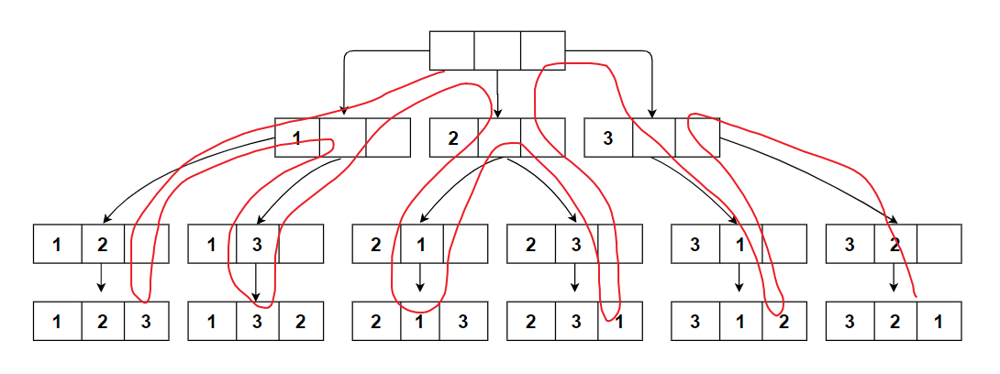
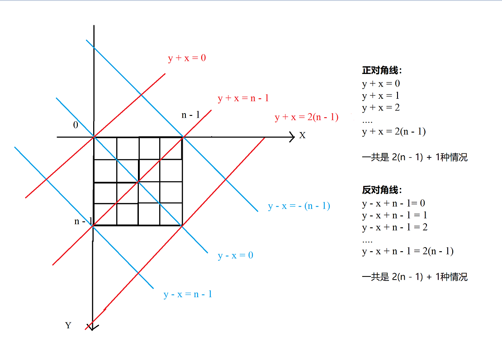
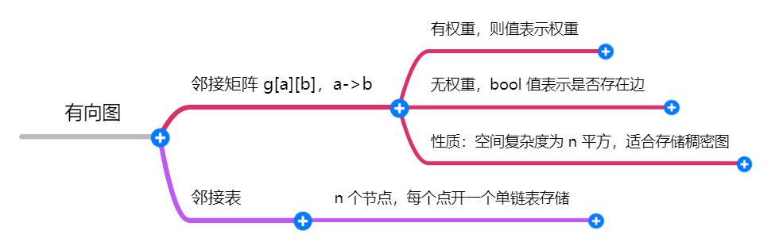
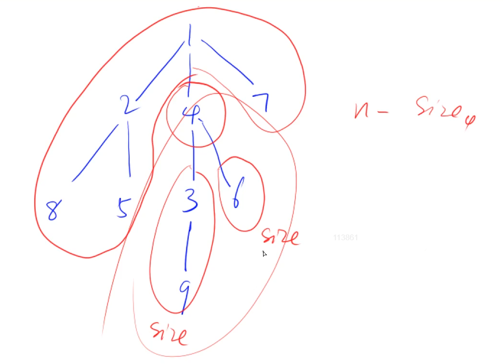

# 1 基础算法

## 1.1 排序

### 1.1.1 快速排序

### 1.1.2 归并排序


## 1.2 二分

## 1.3 高精度

## 1.4 前缀和与差分

## 1.5 双指针算法

## 1.6 位运算

## 1.7 离散化

## 1.8 区间合并


# 2 数据结构

## 2.1 单链表

## 2.2 双链表

## 2.3 栈

## 2.4 队列

## 2.5 单调栈

## 2.6 单调队列

## 2.7 KMP

## 2.8 Trie

## 2.9 并差集

## 2.10 堆

## 2.11 哈希表


# 3 搜索与图论

| 搜索算法 |   数据结构    |           空间           |       性质       |
| :------: | :-----------: | :----------------------: | :--------------: |
|   DFS    |  stack（栈）  | $O(h)$（$h$ 为搜索深度） | 不一定是最短路径 |
|   BFS    | queue（队列） |         $O(2^h)$         |  **最短** 路径   |

## 3.1 DFS

深度优先搜索（Depth First Search, DFS），一种用于搜索树或图的算法。每次都尝试向更深的节点走，搜到头时则回溯，回溯时继续 DFS。

DFS 注意搜索 **顺序**，搜索流程是 **树**。**回溯** 时注意 **恢复现场**，**剪枝** 提高 **搜索效率**。

---

**例题1：**[842. 排列数字](https://www.acwing.com/problem/content/844/)

大致题意：一个整数 $n$，按字典序输出数字 $1∼n$ 的全排列。

<div align = "center"></div>

```cpp
#include<iostream>
using namespace std;

const int N = 10;
int path[N], n;

// u:位置      state:搜索状态（已/未搜索）
void dfs(int u, int state) {
    if (u == n) {
        for (int i = 0; i < n; i++) cout << path[i] << ' ';
        cout << endl;
        return;
    }
    for (int i = 1; i <= n; i++) {
        if (!(state >> i & 1)) {
            path[u] = i;
            dfs(u + 1, state + (1 << i));	// 递归结束则回溯
        }
    }
}
int main() {
    cin >> n;
    dfs(0, 0);
    return 0;
}
```

**注意**：这里 `!(state >> i & 1)` 的使用压缩了状态，避免开 `bool` 数组。

---

**例题 2：** [843. n-皇后问题](https://www.acwing.com/problem/content/845/)

大致题意：将 $n$ 个皇后放在 $n×n$ 的国际象棋棋盘上，任意两个皇后都不能处于同一行、同一列或同一斜线上。

<u>解法1</u>：类似上述搜索全排列的顺序，依次枚举每一行上皇后所在的位置（哪一列）。

时间复杂度分析：$n$ 个皇后不能在同行同列，所以每行恰有一个皇后，我们计算一下在不考虑对角线的情况下，方案数的上限：第一行有 $n$ 个位置可选，第二行有 $n−1$ 个位置可选，依次类推，可得方案数最多是 $n!$，时间复杂度是 $O(n!)$。最终输出整个矩阵的时间复杂度是 $O(n^2)$，整个时间复杂度是 $O(n^2 \times n!)$。

<div align = "center"></div>

```cpp
#include <iostream>
#include <vector>
#include <string>

using namespace std;
const int N = 20;

vector<string> res;
bool col[N], diag[N], rdiag[N];
int n;

// u: 当前遍历的行号
void dfs(int u) {
    if (u == n) {
        for (int i = 0; i < n; i++) cout << res[i] << endl;
        cout << endl;
        return;
    }
    for (int i = 0; i < n; i++) {
        if (!col[i] && !diag[u + i] && !rdiag[u - i + n]) {
            col[i] = diag[u + i] = rdiag[u - i + n] = true;
            res[u][i] = 'Q';
            dfs(u + 1);
            res[u][i] = '.';
            col[i] = diag[u + i] = rdiag[u - i + n] = false;
        }
    }
}

int main() {
    cin >> n;
    res = vector<string>(n, string(n, '.'));
    dfs(0);
    return 0;
}
```


<u>解法2</u>：暴搜所有的方案。对于每步搜索，有两种选择：

1. 当前格子不放皇后，转移 `dfs(x, y + 1, s);`
2. 满足合法性的前提下，当前格子放皇后。

时间复杂度：$O(2^{n^2})$

```cpp
#include<iostream>
#include <vector>
#include <string>

using namespace std;
const int N = 20;

int row[N], col[N], diag[N], rdiag[N];
int n;
vector<string> res;

// x, y 表示搜索起点坐标，s 表示已经放置的总皇后数量
void dfs(int x, int y, int s) {
    if (y == n) x++, y = 0;
    if (x == n) {
        if (s == n) {
            for (int i = 0; i < n; i++) cout << res[i] << endl;
            cout << endl;
        }
        return;
    }
    // 不放皇后
    dfs(x, y + 1, s);
    // 合法前提下，放皇后
    if (!row[x] && !col[y] && !diag[y - x + n] && !rdiag[y + x]) {
        res[x][y] = 'Q';
        row[x] = col[y] = diag[y - x + n] = rdiag[y + x] = true;
        dfs(x, y + 1, s + 1);
        row[x] = col[y] = diag[y - x + n] = rdiag[y + x] = false;
        res[x][y] = '.';
    }
}
int main() {
    cin >> n;
    res = vector<string>(n, string(n, '.'));
    dfs(0, 0, 0);
    return 0;
}
```


## 3.2 BFS

广度优先搜索（Breadth First Search, BFS）。每次都尝试访问同一层的节点，如果同一层都已经访问过，再访问下一层。最终，BFS 算法找到的路径是从起点开始的 **最短** 合法路径，即这条路径所包含的边数最小。

---

**例题1：**[844. 走迷宫](https://www.acwing.com/problem/content/846/)

```cpp
#include <iostream>
#include <cstring>
#include <vector>
#include <queue>

using namespace std;
using PII = pair<int, int>;

const int N = 110;
int n, m;
int g[N][N], d[N][N];
const int dx[4] = {-1, 0, 1, 0}, dy[4] = {0, 1, 0, -1};
PII Prev[N][N];         // 记录路径

int bfs() {
    queue<PII> que;
    que.push({0, 0});
    d[0][0] = 0;
    
    while(!que.empty()) {
        PII it = que.front();
        que.pop();
        for (int i = 0; i < 4; i++) {
            int a = it.first + dx[i], b = it.second + dy[i];
            if (a >= 0 && a < n && b >= 0 && b < m && !g[a][b] && d[a][b] == -1) {
                d[a][b] = d[it.first][it.second] + 1;
                que.push({a, b});
                Prev[a][b] = it;        // 记录路径
            }
        }
    }
    // -------- 记录路径 -----------
    int a = n - 1, b = m - 1;
    while(a || b) {
        cout << a << ' ' << b << endl;
        auto it = Prev[a][b];
        a = it.first, b = it.second;
    }
    // -------- 记录路径 -----------
    return d[n - 1][m - 1];
}

int main() {
    cin >> n >> m;
    for (int i = 0; i < n; i++) {
        for (int j = 0; j < m; j++) {
            cin >> g[i][j];
        }
    }
    memset(d, -1, sizeof d);
    cout << bfs() << endl;
    return 0;
}
```

**例题2：**[845. 八数码](https://www.acwing.com/problem/content/847/)

本题求最小交换步数，用 `BFS` 。每次 `X` 可以与上下左右中任意一个合法位置进行交换，我们将每种情况作为一个节点（转化为 **字符串** 表示），目标情况作为终点。因此将题目转化为求起点到终点的最小交换步数，即为最短路问题。

难点：

1. 如何将一种情况转换为一个节点？
2. 如何记录每一个状态的距离？
3. 队列如何定义？`dist` 数组定义？

```cpp
#include<iostream>
#include <unordered_map>
#include <queue>
#include<string>

using namespace std;
const int dx[4] = {-1, 0, 1, 0}, dy[4] = {0, 1, 0, -1};

int bfs(string start) {
    queue<string> que;
    unordered_map<string, int> d;
    que.push(start);
    d[start] = 0;
    string end = "12345678x";
    while(que.size()) {
        auto t = que.front();
        que.pop();
        
        if (t == end) return d[t];
        
        int distance = d[t];
        int k = t.find('x');
        int x = k / 3, y = k % 3;
        for (int i = 0; i < 4; i++) {
            int a = x + dx[i], b = y + dy[i];
            if (a >= 0 && a < 3 && b >= 0 && b < 3) {
                swap(t[a * 3 + b], t[k]);
                if (!d.count(t)) {
                    d[t] = distance + 1;
                    que.push(t);
                }
                swap(t[a * 3 + b], t[k]);
            }
        }
    }
    return -1;
}

int main() {
    string start = "";
    for (int i = 0; i < 9; i++) {
        char c;
        cin >> c;
        start += c;
    }
    cout << bfs(start) << endl;
    return 0;
}
```


## 3.3 树与图的存储

树：一种无环连通图。故只讨论图的存储。无向图建两条边：`a->b`，`b->a`。

<div align = "center"></div>

<details>
  <summary>邻接表存储图模板</summary>
  <pre><blockcode> 
    // 对于每个点 k，开一个单链表，存储 k 所有可以走到的点。h[k] 存储这个单链表的头结点
    int h[N], e[N], ne[N], idx;
    void add(int a, int b) 		// 添加一条边a->b
    {
        e[idx] = b, ne[idx] = h[a], h[a] = idx++;
    }
    // 初始化
    idx = 0;
    memset(h, -1, sizeof h);
  </blockcode></pre>
</details>
<details>
  <summary>邻接表存储理解</summary>
  <pre><blockcode>
    idx：边的编号(从 0 开始)。
    e[idx]：第 idx 条边所连接的终点。
    w[idx]：边的权重。
    ne[idx]：与 e[idx] 节点属于同一源节点的其他节点的编号，它们都与源节点相连。
    h[a]：链表头节点，值表示 idx，最后插入的边的编号。通过 h[a] 可以从后往前回溯到图中与 a 相连的所有节点。
    // 实在不理解就画图理解，本质就是 h[a] 开了一个个单链表。
  </blockcode></pre>
</details>


## 3.4 树与图的遍历

时间复杂度 $O(n+m)$，$n$ 表示点数，$m$ 表示边数。

### 3.4.1 DFS
<details>
  <summary>DFS 遍历模板</summary>
  <pre><blockcode> 
    int dfs(int u)
    {
        st[u] = true;		// st[u] 表示点u已经被遍历过
        for (int i = h[u]; i != -1; i = ne[i])
        {
            int j = e[i];
            if (!st[j]) dfs(j);
        }
    }
  </blockcode></pre>
</details>
---

**例题1**：[846. 树的重心](https://www.acwing.com/problem/content/848/)

每次 `dfs` 确定以 `u` 为重心的最大连通块的节点数，并更新 `ans`。也即，`dfs` 并不直接返回答案，而是在每次更新中迭代一次答案。

<div align = "center"></div>


```cpp
#include <iostream>
#include <cstring>

using namespace std;
const int N = 1e5 + 10, M = 2 * N;		// 无向图，每条边存两遍，需要两倍空间

int n;
int h[N], e[M], ne[M], idx;
bool st[N];

int ans = N;

void add(int a, int b)  // 添加一条边a->b
{
    e[idx] = b, ne[idx] = h[a], h[a] = idx++;
}

// 以 u 为根的子树中点的数量
int dfs(int u) {
    st[u] = true;       // 标记为已访问

    int sum = 1, res = 0;       // 当前节点算 1 个节，初始值为 1
    for (int i = h[u]; i != -1; i = ne[i]) {
        int j = e[i];
        if (!st[j]) {
            int s = dfs(j);
            res = max(res, s);
            sum += s;
        }
    }
    res = max(res, n - sum);		// res 即为图中 size
    ans = min(ans, res);		// 遍历所有假设重心中，最小的最大连通子图中的节点数
    return sum;
}
 

int main() {
    cin >> n;
    
    memset(h, -1, sizeof h);		// 初始化表头
    
    for (int i = 0; i < n - 1; i++) {
        int a, b;
        cin >> a >> b;
        add(a, b), add(b, a);
    }
    dfs(1);			// 可从任意点开始搜
    cout << ans << endl;
    return 0;
}
```

注意：在遍历一棵树的时候，即使是无向边，也可以将 `st[]` 数组去掉，只需要在 `dfs` 时传入父节点这个参数就可以避免重新搜回父节点。

<details>
  <summary>不用 st 数组的写法</summary>
  <pre><blockcode> 
    int dfs(int u, int father) {
        st[u] = true;       // 标记为已访问
        int sum = 1, size = 0;       // 当前节点算 1 个节，初始值为 1
        for (int i = h[u]; i != -1; i = ne[i]) {
            int j = e[i];
            if (j != father) {
                int s = dfs(j, u);
                size = max(size, s);
                sum += s;
            }
        }
        size = max(size, n - sum);
        ans = min(ans, size);
        return sum;
    }
    int main() {
        cin >> n;
        memset(h, -1, sizeof h);
        for (int i = 0; i < n - 1; i++) {
            int a, b;
            cin >> a >> b;
            add(a, b), add(b, a);
        }
        dfs(1, -1);
        cout << ans << endl;
        return 0;
    }
  </blockcode></pre>
</details>
### 3.4.2 BFS

<details>
  <summary>BFS 遍历模板</summary>
  <pre><blockcode> 
    queue<int> q;
    st[1] = true;		// 表示 1 号点已经被遍历过
    q.push(1);
    while (q.size())
    {
        int t = q.front();
        q.pop();
        for (int i = h[t]; i != -1; i = ne[i])
        {
            int j = e[i];
            if (!st[j])
            {
                st[j] = true;	// 表示点 j 已经被遍历过
                q.push(j);
            }
        }
    }
  </blockcode></pre>
</details>
---

**例题2**：[847. 图中点的层次](https://www.acwing.com/problem/content/849/)

```cpp
#include <iostream>
#include <cstring>

using namespace std;
const int N = 1e5 + 10;

int n, m;
int h[N], e[N], ne[N], idx;
int q[N], hh = 0, tt = -1;      // 数组模拟队列
int d[N];           // 距离起点距离

void add(int a, int b) {
    e[idx] = b, ne[idx] = h[a], h[a] = idx++;
}

int bfs() {
    q[++tt] = 1;
    d[1] = 0;
    while(hh <= tt) {
        int t = q[hh++];
        for (int i = h[t]; i != -1; i = ne[i]) {
            int j = e[i];
            if (d[j] == -1) {
                d[j] = d[t] + 1;
                q[++tt] = j;
            }
        }
    }
    return d[n];
}

int main() {
    cin >> n >> m;
    
    memset(h, -1, sizeof h);
    memset(d, -1, sizeof d);
    
    for (int i = 0; i < m; i++) {
        int a, b;
        cin >> a >> b;
        add(a, b);
    }
    cout << bfs() << endl;
    return 0;
}
```


## 3.5 拓扑排序

**有向无环图** 一定存在拓扑序列，因此有向无环图也称为 **拓扑图**。有拓扑排序 $\iff$ 不存在环。

与一个节点 $v$ 关联的边的条数称作该节点的 **度 (Degree)**，记作 $d(v)$。在有向图 $G=(V,E)$ 中，以一个节点 $v$ 为起点的边的条数称为该节点的 **出度 (Out-degree)**，记作 $d^+(v)$。以一个顶点 $v$ 为终点的边的条数称为该节点的 **入度 (In-degree)**，记作 $d^-(v)$。显然 $d^+(v)+d^-(v)=d(v)$。

---

<details>
  <summary>拓扑排序模板</summary>
  <pre><blockcode> 
    bool topsort() {
        int hh = 0, tt = -1;
        // d[i] 存储点 i 的入度
        for (int i = 1; i <= n; i ++ ) {
            if (!d[i]) {
                q[ ++ tt] = i;
            }
        }
        while (hh <= tt) {
            int t = q[hh ++ ];
            for (int i = h[t]; i != -1; i = ne[i]) {
                int j = e[i];
                if (-- d[j] == 0) {
                    q[ ++ tt] = j;
                }
            }
        }
        // 如果所有点都入队了，说明存在拓扑序列；否则不存在拓扑序列。
        return tt == n - 1;
    }
  </blockcode></pre>
</details>
时间复杂度 $O(n+m)$，$n$ 表示点数，$m$ 表示边数。

---

**例题1**：[848. 有向图的拓扑序列](https://www.acwing.com/problem/content/850/)

```cpp
#include<iostream>
#include<cstring>

using namespace std;

const int N = 1e5 + 10;

int h[N], e[N], ne[N], idx;
int q[N], d[N];     // 队列，入度
int n, m;

void add(int a, int b) {
    e[idx] = b, ne[idx] = h[a], h[a] = idx++;
}

bool topsort() {
    int hh = 0, tt = -1;
    // 入度为 0 的点入队
    for (int i = 1; i <= n; i++) {
        if (!d[i])  q[++tt] = i;
    }
    
    while (hh <= tt) {
        int t = q[hh++];
        
        for (int i = h[t]; i != -1; i = ne[i]) {
            int j = e[i];
            d[j]--;
            if (d[j] == 0)  q[++tt] = j;
        }
    }
    return tt == n - 1;
}
int main() {
    cin >> n >> m;
    
    memset(h, -1, sizeof h);
    
    for (int i = 0; i < m; i++) {
        int a, b;
        cin >> a >> b;
        add(a, b);
        d[b]++;
    }
    if (topsort()) {
        for (int i = 0; i < n; i++) cout << q[i] << ' ';
        cout << endl;
    } else cout << -1 << endl;
    return 0;
}
```

---

扩展题：[2018年安徽省程序设计大赛 B题](https://blog.csdn.net/weixin_43773540/article/details/104943915)

**解题技巧**：用 `map<string, int>` 或者 `unordered_map<string, int>` 来替换原来的整数数组。


## 3.6 最短路

<div align = "center"></div>

### 3.7.1 最短路问题总结

定义：节点数为 $n$，边数为 $m$ ，路径权重为 $w$ 求最短路径。

#### 单源最短路

按照边权 $w$ 的正负分为两种情况：

##### 1. 所有边权都是正数

* 朴素版的 Dijkstra 算法，用于稠密图（边数 $m$ 是 $n^2$ 级别），时间复杂度为 $O(n^2)$

  使用 **邻接矩阵** 存储边。

* 堆优化版的 Dijkstra 算法，用于稀疏图（边数 $m$ 是 $n$ 级别），时间复杂度为 $O(mlogn)$

  使用 **邻接表** 存储从每个点出发的所有邻边。


##### 2. 存在负权边


* Bellman-Ford 算法，时间复杂度为 $O(nm)$。

  求解有 **边数限制** 的最短路问题，使用 Bellman-Ford 算法。

* SPFA 算法，时间复杂度一般情况下为 $O(m)$，最坏情况为 $O(nm)$。（**常用，边权全为正也可用**）

  一般而言，SPFA 算法各方面好于 Bellman-Ford 算法（除去有边数限制的情况）。

  SPFA 算法限制：**图中不能存在负权回路**。


---

负权回路定义：回路权值相加为负数，显然负权回路位于起点到终点的最短路径上就会对结果产生影响。

1. SPFA  算法如何判断负环？

   $cnt[j]$ 表示 $1∼j$ 的最短路上的边数，只要 $cnt[j]$ 大于等于图中的节点数就表示存在负环。

2. Bellman-Ford 算法判断路径中是否存在负权回路？

   如果第 $n$ 次迭代中，更新了 $dist [\ \ ]$ 数组，说明存在一条长度为 $n + 1$ 的最短路径，根据抽屉原理可以说明存在负权回路。

3. SPFA 算法原理？

   SPFA 算法是用队列（堆也可以）优化 Bellman-Ford 算法中距离更新步骤。同时更新其所有出边，不在队列中的需要加入队列。由于 SPFA 只会遍历从起点出发可以访问到的点，所以如果终点不可达，即使存在负权边也不会更新终点的距离值 $dist[n]$，最终只需要用 `0x3f3f3f3f` 来判断起点到终点是否可达。

---


#### 多源汇最短路


- Floyd 算法，时间复杂度为 $O(n^3)$

三重循环， $d[k][i][j]$ 表示从 $i$ 出发经过 $1,2,\dots,k$ 这些点到达 $j$ 点的最短距离。


### 3.7.2 Dijkstra

Dijkstra 算法伪代码：
$$
\begin{array}{ll}
1 &  \textbf{输入. } \text{图中的边 } e , \text{ 每条边 } e \text{ 表示为 } (u, v, w) \text{ 即有一条从 } u \text{ 到 } v \text{ 的边权重为 } w . \\
2 &  \textbf{输出. } \text{最短路径}.\\
3 &  \textbf{Method. } \\
4 &  dist[1] \gets 0, dist[i] \gets \infty \\
6 &  \textbf{for } i \gets 1 \textbf{ to } n \textbf{ do }\\
8 &  \qquad t \gets \text{ 不在 st 中的距离最近的点} \\
9 &  \qquad \text{用 } t \text{ 更新最短距离 }	\\
10 &  \qquad st \gets t \\
11 &  \textbf{return }  最短距离
\end{array}
$$

---

<details>
  <summary>朴素 Dijkstra 算法模板</summary>
  <pre><blockcode> 
    int g[N][N];  // 存储每条边
    int dist[N];  // 存储1号点到每个点的最短距离
    bool st[N];   // 存储某个点是否已经更新过其他点
    // 求 1 号点到 n 号点的最短路，如果不存在则返回 -1
    int dijkstra()
    {
        memset(dist, 0x3f, sizeof dist);
        dist[1] = 0;
        for (int i = 0; i < n - 1; i++)		//第 n 次循环时不会再对 dist 数组产生影响
        {
            int t = -1;     // 未确定最短路的点中，寻找距离最近的点
            for (int j = 1; j <= n; j ++ )
                if (!st[j] && (t == -1 || dist[t] > dist[j]))
                    t = j;
            // 用t更新其他点的距离
            for (int j = 1; j <= n; j ++ )
                dist[j] = min(dist[j], dist[t] + g[t][j]);
            st[t] = true;
        }
        if (dist[n] == 0x3f3f3f3f) return -1;
        return dist[n];
    }
  </blockcode></pre>
</details>

时间复杂是 $O(n^2+m)$，$n$ 表示点数，$m$ 表示边数。

---

**例题1**：[849. Dijkstra求最短路 I](https://www.acwing.com/problem/content/851/)

```cpp
#include<iostream>
#include<cstring>

using namespace std;

const int N = 510;
int g[N][N];        // 邻接矩阵
int dist[N];        // 存储每个点到起点的最短距离
bool st[N];         // 存储某个点是否已经更新过其它点

int n, m;

int dijkstra() {
    dist[1] = 0;
    
    for (int i = 0; i < n; i++) {
        int t = -1;         // 不在集合 st 中距离最近的点
        for (int j = 1; j <= n; j++) {
            if (!st[j] && (t == -1 || dist[t] > dist[j])) {
                t = j;
            }
        }
        // t 更新最短路径
        for (int j = 1; j <= n; j++) {
            dist[j] = min(dist[j], dist[t] + g[t][j]);
        }
        // t 加入集合 st，表示已用于更新过其它点
        st[t] = true;
    }
    if (dist[n] == 0x3f3f3f3f) return -1;
    return dist[n];
}

int main() {
    cin >> n >> m;
    
    memset(g, 0x3f, sizeof g);
    memset(dist, 0x3f, sizeof dist);
    
    while (m--) {
        int x, y, z;
        cin >> x >> y >> z;
        g[x][y] = min(g[x][y], z);      // 存在重边时取最小权重值
    }
    cout << dijkstra() << endl;
}
```

注意：`st` 未确定最短路径的点的集合。

扩展：求 $a \rightarrow b$ 的最短路径， 初始化 $dist[a] \gets 0$ ，函数返回 $dist[b]$ 。

---

<details>
  <summary>堆优化版 dijkstra 算法模板</summary>
  <pre><codeblocks> 
    typedef pair<int, int> PII;
    int n;          // 点的数量
    int h[N], w[N], e[N], ne[N], idx;       // 邻接表存储所有边
    int dist[N];    // 存储所有点到1号点的距离
    bool st[N];     // 存储每个点的最短距离是否已确定
    // 求1号点到n号点的最短距离，如果不存在，则返回-1
    int dijkstra()
    {
        memset(dist, 0x3f, sizeof dist);
        dist[1] = 0;
        priority_queue<PII, vector<PII>, greater<PII>> heap;
        heap.push({0, 1});      // first存储距离，second存储节点编号
        while (heap.size())
        {
            auto t = heap.top();
            heap.pop();
            int ver = t.second, distance = t.first;
            if (st[ver]) continue;
            st[ver] = true;
            for (int i = h[ver]; i != -1; i = ne[i])
            {
                int j = e[i];
                if (dist[j] > distance + w[i])
                {
                    dist[j] = distance + w[i];
                    heap.push({dist[j], j});
                }
            }
        }
        if (dist[n] == 0x3f3f3f3f) return -1;
        return dist[n];
    }
  </codeblocks></pre>
</details>


时间复杂度 $O(mlogn)$，$n$ 表示点数，$m$ 表示边数。


### 3.7.3 bellman-ford


### 3.7.4 spfa


### 3.7.5 Floyd


## 3.8 最小生成树

### 3.8.1 最小生成树问题总结

#### 1. $Prim$ 算法

* 朴素 $Prim$ ，用于稠密图，时间复杂度为 $O(n^2)$
* 堆优化版 $Prim$，用于稀疏图，时间复杂度为 $O(mlogn)$，优化方式和 $Dijkstra$ 算法很相似。

#### 2. $Kruskal$ 算法

* 时间复杂度为 $O(mlogm)$

**注**：实际使用时，如果是稠密图选用朴素 $Prim$，如果是稀疏图选用 $Kruskal$ 算法。鉴于$Kruskal$ 算法的优势，堆优化版 $Prim$ 算法用的较少。


### 3.8.2 Prim


### 3.8.3  Kruskal


## 3.9 二分图

### 3.9.1 二分图问题总结

定义：图中所有的点分为两边，使得所有边都在集合之间，集合内部没有边。

数论性质：一个图是二分图当且仅当图中不含奇数环。

#### 1. 染色法（用于判定二分图）

由于图中不含有奇数环，所以染色过程中一定没有矛盾。

* 时间复杂度为 $O(n + m)$

#### 2. 匈牙利算法

* 时间复杂度为 $O(mn)$，实际运行时间一般远小于 $O(mn)$

**注**：思路和最大流很相似。


### 3.9.2 染色法判定二分图


### 3.9.3  匈牙利算法


